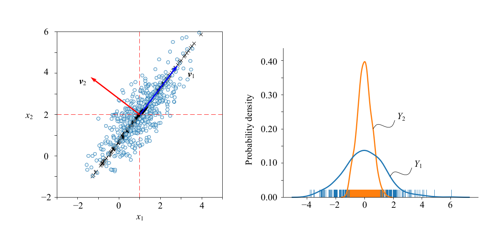
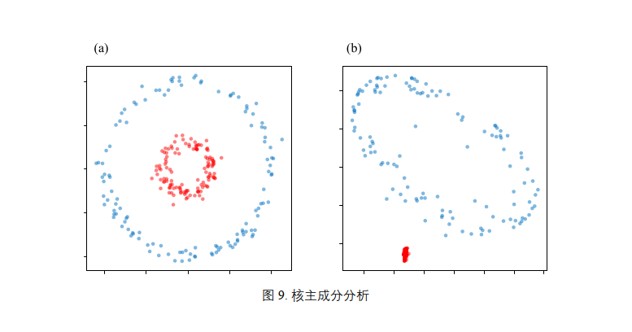
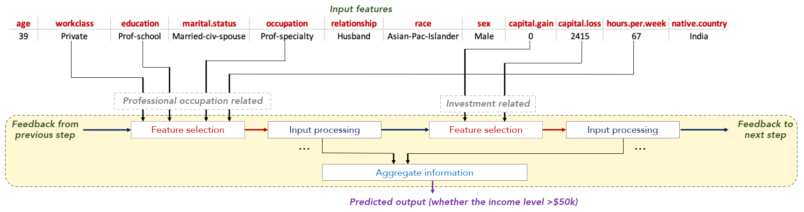

# **基于多种分类算法的人口收入预测**

---

---

## **导言**

对于机器学习建模的一般过程：

<iframe src='./image/大纲.html' width='100%' height='260'></iframe>

---

## **一、数据预处理**

| ATTRIBUTE NAME |  ROLE  |    TYPE    | DESCRIPTION | UNITS | MISSING VALUES |
| :------------: | :-----: | :---------: | :---------: | :---: | :------------: |
|      age      | Feature | Continuous |     N/A     |      |     False     |
|   workclass   | Feature | Categorical |            |      |     False     |
|     fnlwgt     | Feature | Continuous |            |      |     False     |
|   education   | Feature | Categorical |            |      |     False     |
| education-num | Feature | Continuous |            |      |     False     |
| marital-status | Feature | Categorical |            |      |     False     |
|   occupation   | Feature | Categorical |            |      |     False     |
|  relationship  | Feature | Categorical |            |      |     False     |
|      race      | Feature | Categorical |            |      |     False     |
|      sex      | Feature | Categorical |            |      |     False     |
|  capital-loss  | Feature | Continuous |            |      |     False     |
| hours-per-week | Feature | Continuous |            |      |     False     |
| native-country | Feature | Categorical |            |      |     False     |
|     class     | Target | Categorical |            |      |     False     |

==处理步骤：==

1. 处理缺失值：首先需要查看数据集中是否存在缺失值
   - 删除包含缺失值的行或列：如果比例较小且不影响整体分析，可以考虑直接删除缺失值所在的行或列。
   - 填充缺失值：
     - 基于统计量的填充
     - 基于模型的预测
     - 基于插值方法
2. 处理异常值：查看数据集中是否存在异常值，比如`年龄小于18岁`或大于100岁的数据。
3. 处理重复值：查看数据集中是否存在重复值，可以通过删除重复值或者保留其中一个来处理重复值。

---

## **二、数据探索**

<iframe src='./image/0_1.html' width='100%' height='670'></iframe>

<iframe src="./image/0_2.html" width="100%" height="660"></iframe>

<iframe src="./image/0_3.html" width="100%" height="700"></iframe>

<iframe src="./image/0_4.html" width="100%" height="590"></iframe>

<iframe src="./image/0_5.html" width="100%" height="600"></iframe>

<iframe src="./image/0_8.html" width="600" height="600"></iframe>

<iframe src="./image/0_9.html" width="600" height="500"></iframe>

<iframe src="./image/0_10.html" width="100%" height="700"></iframe>

<iframe src="./image/0_11.html" width="100%" height="700"></iframe>

<iframe src="./image/0_12.html" width="100%" height="700"></iframe>

<iframe src="./image/0_13.html" width="100%" height="700"></iframe>

<iframe src="./image/0_14.html" width="100%" height="600"></iframe>

<iframe src="./image/0_15.html" width="600" height="600"></iframe>

<iframe src="./image/0_16.html" width="100%" height="600"></iframe>

<iframe src="./image/0_17.html" width="100%" height="650"></iframe>

<iframe src="./image/0_18.html" width="100%" height="450"></iframe>

<iframe src="./image/0_19.html" width="100%" height="650"></iframe>

---

## 三、**特征工程**

==处理步骤：==

1. 特征编码： 对于分类变量，可以使用 **OneHotEncoder**、**LabelEncoder** 或 **CatBoostEncoder**等方法进行编码，将其转换为数值表示。对于有序分类变量，可以使用**LabelEncoder**进行编码。
2. 特征缩放： 对于数值型特征，可以进行特征缩放，使其具有相同的尺度范围。常见的缩放方法包括标准化（**StandardScaler**）或归一化（**MinMaxScaler**）等。
3. 特征构造： 可以通过组合已有特征或创建新的特征来增强模型的表达能力。例如，可以计算两个数值型特征的差值或比值，创建交互特征等。
4. 特征选择： 根据数据集的特点和建模需求，选择最具预测能力的特征。可以通过特征相关性分析、特征重要性评估（如基于树模型的特征重要性）或基于模型的特征选择方法等进行特征选择，降维。
5. 处理类别不平衡： 如果数据集存在类别不平衡问题，可以采取一些方法来处理，例如过采样、欠采样或使用类别权重等。

==强调---特征编码：==

1. **OneHotEncoder**：

    - 适用于无序分类变量（**Nominal Variables**）。
    - 将每个分类变量的每个取值转换为一个独立的二进制特征（虚拟变量），扩展了数据集的维度。
    - 适合于分类变量之间没有明显的顺序关系，且分类变量取值数量较少的情况。
    - 对于取值较多的分类变量，会导致编码后的特征数量增加，可能会增加模型的复杂度。

2. **LabelEncoder**：

    - 适用于有序分类变量（**Ordinal Variables**）。
    - 将每个分类变量的每个取值映射为一个整数标签，不会增加数据集的维度。
    - 适合于分类变量具有明确的顺序关系的情况，如教育程度的高低。
    - 不会增加特征的数量，但是模型可能会错误地认为不同的整数值之间存在某种顺序关系，需要小心处理。

3. **CatBoostEncoder**是一种基于目标均值编码的特征编码方法，特别适用于处理分类变量。它利用了目标变量的信息来对无序分类变量进行编码，从而提供了一种有效的方式来处理高基数分类变量和特征之间的关系。

    **CatBoostEncoder**的主要思想是将每个分类变量的取值替换为其在目标变量上的均值。通过这种方式，**CatBoostEncoder**捕捉了分类变量与目标变量之间的关联性，并为分类变量赋予了更有信息量的编码值。

    **CatBoostEncoder**的实现中，会使用目标变量进行 **K** 折交叉验证，计算每个分类变量取值在训练集中的目标变量均值。然后，将这些均值作为编码后的值替换原始的分类变量取值。这样，每个分类变量的取值都被映射为目标变量的平均值，从而构建了分类变量与目标变量之间的关联性。

==回看数据：==

​		无序分类变量：

| 类型 | 类型 |
| :----: | :----: |
| workclass（就业类型） | marital-status（婚姻状况） |
| occupation（职业） | relationship（与家庭关系） |
| native-country（原籍国） | sex（性别） |

​		有序分类变量：

| education-num（教育年限） | hours-per-week（每周工作小时数） |
| :-----------------------: | :------------------------------: |

==无关属性==

1. 'education': 受教育程度，与'education-num'重复，只需要保留一个即可。
1. 'fnlwgt'：是序号，删除

==降维==

1. 主成分分析（**Principal Component Analysis，PCA**）：**PCA**通过线性变换将原始特征映射到一组新的正交特征上，新特征称为主成分。主成分按照方差大小排序，通过选择前 **K** 个主成分，可以实现对数据的降维。

    

    

    

2. 线性判别分析（**Linear Discriminant Analysis，LDA**）：**LDA**是一种监督降维方法，它旨在最大化类间距离和最小化类内距离。LDA将数据投影到低维空间中，使得同类样本尽可能接近，不同类样本尽可能远离。

3. **t-SNE**（**t-Distributed Stochastic Neighbor Embedding**）：是一种非线性降维方法，它可以在可视化高维数据时保留数据之间的局部关系。**t-SNE**通过优化目标函数，将高维数据映射到二维或三维空间。

    

4. **Isomap**：是一种基于流形学习的降维方法，它通过保持数据样本之间的测地距离关系来进行降维。保持数据的局部几何结构方面效果较好。

    

5. 非线性主成分分析（**Nonlinear PCA**）：非线性主成分分析是主成分分析的扩展，它可以处理非线性关系。非线性PCA通过引入核技巧或者使用神经网络等方法，在非线性数据中进行降维。

    

==处理不平衡数据集：==：

1. 重采样：通过欠采样（随机删除高收入类别的样本）或过采样（复制低收入类别的样本或生成合成样本）来平衡数据集.
2. 类别权重：在训练模型时，给予不同类别的样本不同的权重，以便模型更关注少数类别。
3. 阈值调整：对于分类模型的预测结果，可以调整分类的阈值，以更好地平衡精确率和召回率。
4. 数据增强：可以采取对抗网络的方式，产生数据。
5. 使用集成方法：集成方法对不平衡数据集进行预测，可以通过结合多个模型的预测结果来改善性能。

---

## **四、模型选择与训练**

==模型的选择：==

- 基模型
    - 逻辑回归（**Logistic Regression**）
    - 决策树（**Decision Tree**）
    - 支持向量机（**Support Vector Machine**）
    - 朴素贝叶斯（**Naive Bayes**）
    - $K$近邻算法（**K-Nearest Neighbors，KNN**）及其改进算法
- 集成模型
    - **Boosting**
      - [**XGBoost**（**eXtreme Gradient Boosting**）](https://arxiv.org/pdf/1603.02754.pdf)
        - [**LightGBM**](https://dl.acm.org/doi/pdf/10.5555/3294996.3295074))
        - [**CatBoost**](https://arxiv.org/pdf/1706.09516.pdf)
        - [**AdaBoost**](https://cseweb.ucsd.edu/~yfreund/papers/boostingexperiments.pdf))
    - **Bagging**
    - **Voting**
    - **Stacking**
- [自动机器学习（**AutoML**）](https://www.automl.org/wp-content/uploads/2020/07/AutoML_2020_paper_61.pdf)
- 深度学习与神经网络
    - 多层感知机（**Multilayer Perceptron**）
    - [**TabNet**](https://arxiv.org/pdf/1908.07442.pdf)
        - **TabTransformer**：**TabTransformer**模型基于**Transformer**结构，专门设计用于表格数据的处理和分类。它利用自注意力机制来学习表格数据中特征之间的关系，并生成相应的分类结果。

### **(一)、逻辑回归**

> `最大熵模型`的在二分类问题上的具体应用，一般的分类问题会被转化为如下的`最优化问题`：

假设我们有输入特征 $x$ 和二元标签 $y$，其中 $y$ 取值为 0 或 1。我们希望通过最大熵原理来建模 $P(y=1|x)$ 的概率分布。
$$
P(y=1|x) = \frac{1}{1 + e^{-w^T * x + b}}
$$

$$
\mathbf{max}\quad L(w, b) = \sum y * log(P(y=1|x)) + (1-y) * log(P(y=0|x))
$$

==一般情况==

<iframe src='./image/4_1_1.html' width='100%' height=620></iframe>

<iframe src='./image/4_1_2.html' width='100%' height=600></iframe>

==欠采样：==

<iframe src='./image/4_1_5.html' width='100%' height=620></iframe>

<iframe src='./image/4_1_4.html' width=900 height=600></iframe>

==过采样==

<iframe src='./image/4_1_6.html' width='100%' height=620></iframe>

<iframe src='./image/4_1_7.html' width=900 height=600></iframe>

==权重调整==

<iframe src='./image/4_1_7.html' width=900 height=600></iframe>

==降维==

<iframe src='./image/4_1_8.html' width='100%' height=620></iframe>

<iframe src='./image/4_1_9.html' width=900 height=600></iframe>

### **(二)、决策树**

==特征选择==

<iframe src='./image/4_2_1.html' width=900 height=600></iframe>

<iframe src='./image/4_2_2.html' width='100%' height=620></iframe>

<iframe src='./image/4_2_3.html' width=900 height=600></iframe>

### **(三)、支持向量机**

<iframe src='./image/4_3_1.html' width='100%' height=620></iframe>

<iframe src='./image/4_3_2.html' width=900 height=600></iframe>

### **(四)、朴素贝叶斯**

<iframe src='./image/4_4_1.html' width=900 height=600></iframe>

<iframe src='./image/4_4_2.html' width='100%' height=620></iframe>

<iframe src='./image/4_4_3.html' width=900 height=600></iframe>

### **(五)、最近邻算法**

<iframe src='./image/4_5_1.html' width=900 height=600></iframe>

<iframe src='./image/4_5_2.html' width='100%' height=620></iframe>

<iframe src='./image/4_5_8.html' width=900 height=600></iframe>

==KD树分类器==

<iframe src='./image/4_5_6.html' width='100%' height=620></iframe>

<iframe src='./image/4_5_7.html' width=900 height=600></iframe>

### **(六)、Boosting 方法**

#### **0、原理：**

> ​		 前提：在概率近似正确（**Probably Approximately Correct**，**PAC**）的学习框架中，对于一个类可以用多项式算法去学习它，并且正确率很高，那就是`强可学习`；如果对于一个类可以用多项式算法去学习它，但是正确率仅仅比随机猜测好一点，那就是`弱可学习`，神奇的是：在**PAC**的框架下，强学习的`充分必要条件`是弱学习。
>
> ​		 训练为阶梯状，基础模型之间是有顺序的，每一个基础模型都是在前一个的基础模型之上，进行学习的，最终综合所有的基础模型的预测值，产生结果，用的最多的就是加权聚合。总而言之一句话目的就是希望：“三个臭皮匠，顶个诸葛亮。”
>
> ​		 对于二分类就下面这个公式：
> $$
> h(x) = \sum_{i=1}^{K} z_ih_{i}(x), \quad K是假设类别、z_i是第i个假设类别的权重
> $$

> 模型的优点：
>
> - `减少偏差`：假设空间的局限性改进（**e.g. **逻辑斯谛回归假设空间是线性的、朴素贝叶斯假设是彼此独立的）
> - `减少方差`

> **Boosting 方法**解决问题的出发点：
>
> - 每轮如何改变训练数据的概率分布或权重？？？
> - 如何将弱分类器组合成一个强大的分类器？？？

#### 1、[XGBoost 模型](https://arxiv.org/pdf/1603.02754.pdf)

> **Boosting 方法**解决问题的出发点：
>
> - 每轮如何改变训练数据的概率分布或权重？？？
>     - **XGBoost**使用梯度提升算法，每轮迭代中根据前一轮的残差来调整样本的权重，以使得下一轮的模型能够更好地拟合残差。这个过程是通过优化损失函数来实现的。
> - 如何将弱分类器组合成一个强大的分类器？？？
>     - **XGBoost**将多个弱分类器（决策树）按照一定的规则进行组合，例如通过累加各个弱分类器的预测结果来得到最终的模型预测结果。同时，**XGBoost**也会为每个弱分类器分配一个权重，这个权重反映了该弱分类器对最终模型的贡献度。

<iframe src='./image/4_6_3_1.html' width='600', height='600'></iframe>

<iframe src='./image/4_6_3_2.html' width='100%', height='620'></iframe>

<iframe src='./image/4_6_3_3.html' width='600', height='600'></iframe>

#### **2、[LightGBM 模型](https://dl.acm.org/doi/pdf/10.5555/3294996.3295074)**

>**Boosting 方法**解决问题的出发点：
>
>- 每轮如何改变训练数据的概率分布或权重？？？
>    - 使用一种称为**Leaf-wise**的生长策略，这种策略会在每次分裂时选择最能降低损失函数的叶子节点。由于这种策略可能会导致某些叶子节点的样本较少，因此采用了基于梯度的直方图算法来对数据进行离散化处理，将连续的特征值转化为离散的区间，从而减少内存使用和计算复杂度。
>- 如何将弱分类器组合成一个强大的分类器？？？
>    - 采用了一种级联的训练方式.
>    - 使用梯度提升算法，根据前一轮的残差进行训练，以逐步减小残差的梯度。
>    - 使用特征并行化和数据并行化等技术来并行训练多个弱分类器，加速模型的训练过程。

<iframe src='./image/4_6_4_1.html' width='600', height='600'></iframe>

<iframe src='./image/4_6_4_2.html' width='100%', height='620'></iframe>

<iframe src='./image/4_6_4_3.html' width='600', height='600'></iframe>

#### **3、[CatBoost 模型](https://arxiv.org/pdf/1706.09516.pdf)**

>**Boosting 方法**解决问题的出发点：
>
>- 每轮如何改变训练数据的概率分布或权重？？？
>    - 采用了一种基于对称树的增长策略，有效地利用特征统计信息来平衡树的增长过程。
>    - 使用**Ordered Boosting**的技术来处理分类特征。它通过对分类特征的值进行排序，并为每个特征值分配一个权重，以便在训练过程中更好地处理分类特征。这有助于提高模型对分类特征的建模能力。
>- 如何将弱分类器组合成一个强大的分类器？？？
>    - 使用最速下降法来训练弱分类器，以逐步减小损失函数的梯度。通过对多个弱分类器的预测结果进行加权求和，得到最终的模型预测结果。
>    - 支持类别特征的自动转换，以便在弱分类器中更好地处理这些特征。

<iframe src='./image/4_6_5_1.html' width='600', height='600'></iframe>

<iframe src='./image/4_6_5_2.html' width='600', height='620'></iframe>

<iframe src='./image/4_6_5_3.html' width='600', height='600'></iframe>

#### **4、[AdaBoost 模型](https://cseweb.ucsd.edu/~yfreund/papers/boostingexperiments.pdf)**

<iframe src='./image/4_6_6_1.html' width='600', height='600'></iframe>

<iframe src='./image/4_6_6_2.html' width='100%', height='620'></iframe>

<iframe src='./image/4_6_6_3.html' width='600', height='600'></iframe>

### **(七)、Stacking**

**原理：**

<iframe src='./image/4_7_1.html' height='620' width='600'></iframe>

<iframe src='./image/4_7_2.html' height='600' width='600'></iframe>

### **(八)、Voting**

<iframe src='./image/4_8_1.html' height='620' width='600'></iframe>

<iframe src='./image/4_8_2.html' height='600' width='600'></iframe>

### **(九)、Bagging**

<iframe src='./image/4_9_1.html' height='620' width='600'></iframe>

<iframe src='./image/4_9_2.html' height='600' width='600'></iframe>

==**特殊的$Bagging模型：随机森林$**==

<iframe src='./image/RF.html' height='700'></iframe>

<iframe src='./image/4_6_1_1.html' height='600' width='600'></iframe>

<iframe src='./image/4_6_1_2.html' height='620' width='600'></iframe>

<iframe src='./image/4_6_1_3.html' height='600' width='600'></iframe>

### **(十)、多层感知机**

<iframe src='./image/4_10_3.html' width='100%' height='910'></iframe>

<iframe src='./image/4_10_1.html' width='100%' height=600></iframe>

<iframe src='./image/4_10_2.html' width='100%' height='600'></iframe>

### (十一)、[TabNet 模型](https://arxiv.org/pdf/1908.07442.pdf)

> 介绍：一种新的高性能和可解释的规范深度表格数据学习架构，使用`顺序注意力`来选择在每个决策步骤中推理哪些特征，从而实现可解释性和更高效的学习。

> 优点：
>
> - 可以不用数据预处理。
> - **TabNet**使用顺序注意力来选择在每个决策步骤中推理哪些特征，从而实现可解释性和更好的学习。
> - 实现了两种可解释性：`局部可解释性`和`全局可解释性`，前者可视化特征的重要性及其组合方式，后者量化每个特征对训练模型的贡献。

==后续的改进：添加TransFormer==

将结构简单化：

<iframe src='./image/4_11_2.html' width='100%' height='600'></iframe>

## (五)、总结

| 模型                                                         | 精度($\%$) | **AUC**($\%$) | 模型                                                         | 精度($\%$) | **AUC**($\%$) |
| ------------------------------------------------------------ | ---------- | ------------------------------------------------------------ | ------------------------------------------------------------ | ---------- | ------------------------------------------------------------ |
| 逻辑回归                                                     | 83         | 87                                                           | **XGBoost** | 87         | 89                                                           |
| 决策树                                                       | 86         | 88                                                           | **LightGBM** | 87         | 89                                                           |
| 支持向量机                                                   | 85         | 84                                                           | **CatBoost** | 87         | 89                                                           |
| 朴素贝叶斯                                                   | 81         | 85                                                           | **AdaBoost** | 85         | 89                                                           |
| 最近邻                                                       | 84         | 88                                                           | **Stacking** | 86         | 89                                                           |
| 多层感知机                                                   | 90         | 88                                                           | **Voting** | 85         | 88                                                           |
| **Tabnet**模型 | 90         | 89                                                           | **Bagging** | 87         | 83                                                           |

